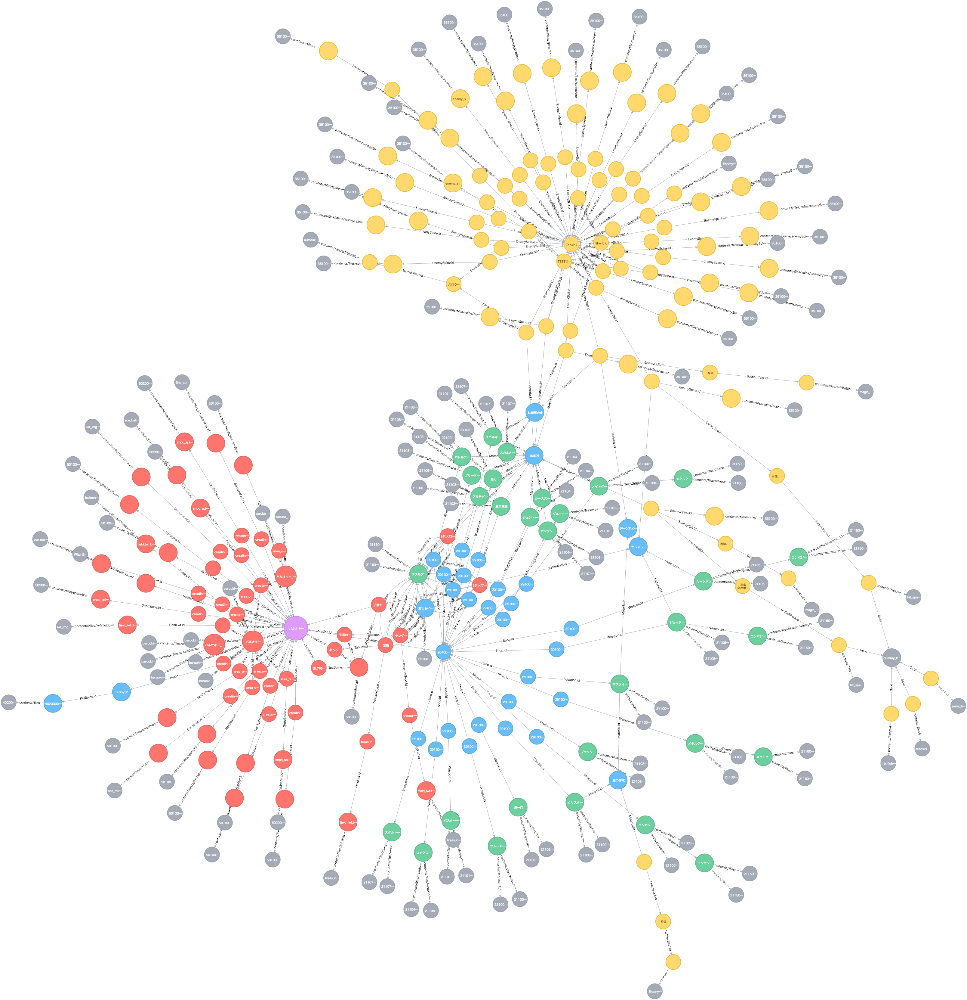

# GraphDB Neo4j
マスタデータのファイル参照を管理するために Graph DB Neo4J を導入しています



## セットアップ
### インストール

brew で入れましょう

```
$ brew install neo4j
```

これで /usr/local/Celler/neo4j 以下にインストールされます

設定ファイルは /usr/local/Cellar/neo4j/<version>/libexec/conf/ 以下にあります。

neo4j-server.properties などはリモートから触れるようにする場合に設定する必要があります。

またデータベースを分ける場合などにもいじる必要があるでしょう

### 起動
neo4j コマンドで行います

```
$ neo4j start
```

これで http://localhost:7474/browser/ からアクセスすることができます

停止は stop コマンドです

```
$ neo4j stop
```

## リファレンス
- Cypher リファレンス
  http://neo4j.com/docs/stable/preface.html
- Neo4j Python Client リファレンス
  http://neo4j-rest-client.readthedocs.org/en/latest/index.html
- Neo4j Browser リファレンス
  http://neo4j.com/developer/guide-neo4j-browser/

## マスタデータ

### インポート
import.py を使います

```
$ ./neo4j/import.py kms_master_asset/master_derivatives/master_schema.json kms_master_asset/master_derivatives/master_data.json kms_master_asset --css-path graphstyle.grass
```

デフォルトのサーバは Neo4j のデフォルトと同じく localhost:7474 です

### データ構成
4 種類のノードとリレーションがあります

#### スキーマ系
テーブル定義とファイル参照定義から構成されています。
各ノードのラベルに suffix が付くのが特長です

- Node = ファイル参照を拡張子でグルーピングしているのが特長です
  - テーブル定義 <テーブル名>:t = reference の関係性を構築するものです
  - ファイル参照定義 <拡張子>:f = file_reference の関係性を構築するものです
- Relationship = schema の定義をそのままリレーションにしています
  - テーブル参照関係 <テーブル名.カラム>:t = reference によるリレーションです
  - ファイル参照関係 <参照パスformat>:f = file_reference によるリレーションです

#### データ系
データ系は master_data.json の個別のデータを関係性で結びつけたものです

- Node
  - データ <テーブル名> = 実際のマスタデータの1レコードです 
  - ファイル <実パス> = file_reference と asset.dir で与えたディレクトリ以下にある実ファイルから生成します (= つまり、実際に存在しているファイルのパスです）
- Relationship
  - データ参照関係 <テーブル名.カラム> = reference によるリレーションです (format の規則によって、実際に ID を紐付けています）
  - ファイル参照関係 <参照パス> = file_reference によるリレーションです（実際に存在するファイルのみです）

##### TODO
- json 系のマスタデータ（ネストがあるもの）は現在、入れていません
- ユーザデータのマッピングにはまだ対応していません (まじめにやるなら DynamoDB + Titan でやったほうがいいかな。。）

#### インデックス系
データ系についてはインデックスを張っています

- key attribute
- index attribute
- '_' 系の Neo4j 用の補助情報

### 経路探索のデザイン
cost を各 ラベル (Node) に対して設定しています。

```
match p = shortestpath((l:Location {id: 510000001})-[r*]-(f {_nodeType: 'file'}))
with reduce(cost = 0, n in nodes(p) | cost + n._cost) as c, l, f, p
where c <= 50
return p; for visualization
```

このように with reduce を使うことで、探索された経路のコストを計算することができます

その結果を where の条件とすることで、経路を絞り込むことができます

#### コストの設定
コストは base.xlsx の sheet に cost 列としてテーブルごとに入力することができます

コストを重くするのは、大量の被参照が集まりやすいテーブルです
- ファイルのホルダとして定義されたテーブル (e.g. CharacterSpine, FieldLwf, Bgm)
- 武器の一覧等のテーブル (Weapon, Armor, Material)
- 分類時の主キーになるテーブル (主キーをまたがって経路探索してしまうのを避ける）(e.g Location, Character)

## Cypher クエリ
neo4j-shell を使っても構いませんが、query.py を使うと、結果を JSON で出力することができます

```
$ ./neo4j/query.py kms_master_asset/cypher/location_file_list.cypher kms_master_asset/manifests/location_file_list.json 
```

--aggrigate を使うと、左側のカラムで集約してくれます
(もちろん cypher 側で集約して出してもかまいません）

### CSV 出力
csv で取得したい場合は、neo4j-shell-tools で neo4j-shell を拡張すると便利です

https://github.com/jexp/neo4j-shell-tools

### Cypher サンプル

基本的には shortestpath を必ずつけて実行するようにしましょう。

そうでないと、結果が発散してしまい、クエリが返ってこなくなります。

#### 特定のファイルパスが DB 上に登録されているかを調べる
ファイルノードを探索してもよいですが、実パスでセットされたリレーションを調べるほうがシンプルになります

```
match ()-[r]-() where type(r) ends with "tsukikage/ground/ground01.png" return r;
```

実際には contens/files/areaAtlas の下に ends with あるので、ends with で探索しましょう

#### 特定のファイルパスが対象の Location に所属しているかを調べる
```
match p = shortestpath((s:Location {id: 510000001})-[r*]-(d {realPath: "contents/files/areaAtlas/route99/route99_ground_0.png"})) return p;
```

- {id: 510000001} = 510000001 (バルオキー）
- {realPath: "contents/files/areaAtlas/route99/route99_ground_0.png"} = route99_ground_0.png 

所属していれば参照経路が表示されます。
所属していなければ表示されません。

#### 特定のファイルパスの所属する Location を調べる
上記のクエリで Location 側の ID 指定をはずすことで、ファイルが関連づけられた Location とその経路をすべて洗い出すことができます。

```
match p = shortestpath((s:Location)-[r*]-(d {realPath: "contents/files/areaAtlas/route99/route99_ground_0.png"})) return p;
```

#### 特定の Location に所属するすべてのファイルを調べる

```
match p = shortestpath((s:Location {id: 510000001})-[r*]-(d:`.png`})) 
with reduce(cost = 0, n in nodes(p) | cost + n._cost) as c, d, p 
where c <= 20 
return p;
```

結果が多すぎるので、with reduce + where を用いるとよいでしょう

```
match p = shortestpath((s:Location {id: 510000001})-[r*]-(d:`.png`})) 
with reduce(cost = 0, n in nodes(p) | cost + n._cost) as c, d, p 
where c <= 50 
return p;
```

これでコストが 50 以下で Location.id 510000001 に紐付いたすべての .png ファイルのリストを得ることができます

### Neo4j Browser
Neo4j Browser は Grass ファイルで設定をアップロードすることができます

#### 色分け
import.py で --css-path を指定すると、投入したデータに合わせたスタイルファイルが出力されるので、
Browser の "Favarites" > "Style / Graph Style Sheet" > "Graph Style Sheet" > "Dropa grass-file here to import" からセットしましょう

#### クエリブックマーク
TODO 作成法の整理
Browser の "Favarites" > "Import" > "Drop a file to import Cypher or Grass" からセットしましょう

